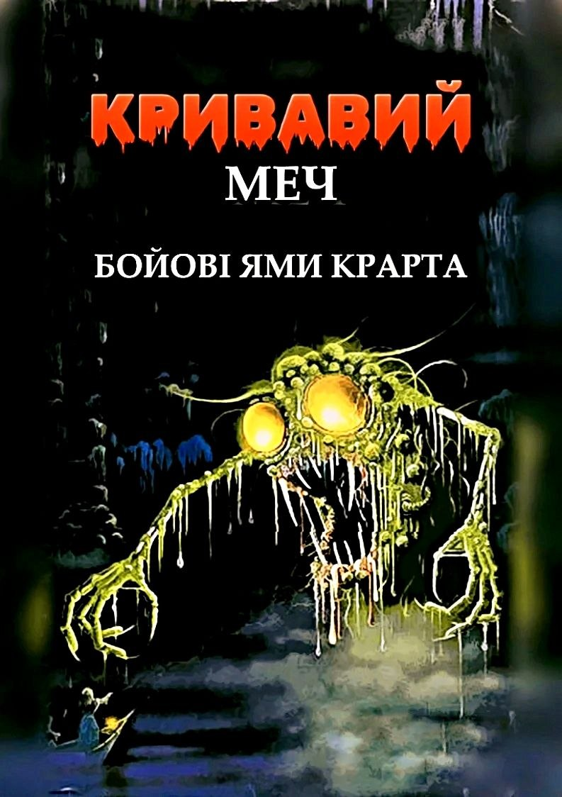
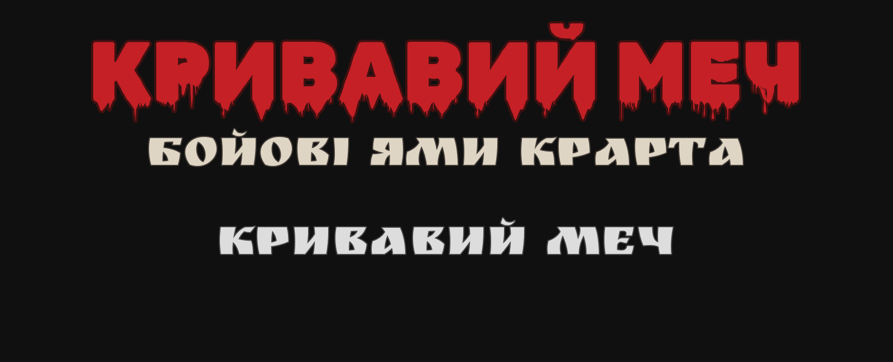
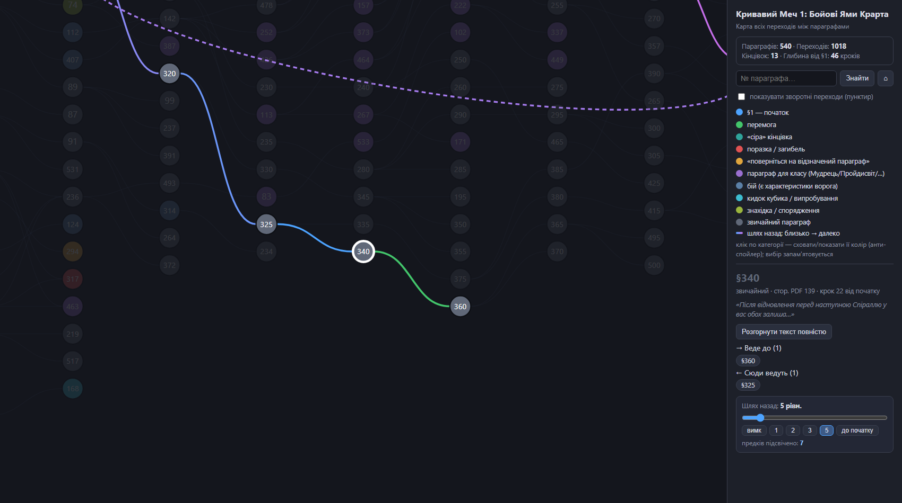

  

<h1 align="center">Кривавий Меч 1: Бойові Ями Крарта</h1>

  <i>Blood Sword #1 — The Battlepits of Krarth</i> 
  Дейв Морріс, Олівер Джонсон · 1987  
  <b>Повний український переклад · 210 сторінок · усі ілюстрації</b>

---

**«Кривавий Меч»** — легендарна серія книг-ігор, єдина серед класики жанру,
розрахована на спільну гру **від одного до чотирьох гравців**. Оберіть свого
героя — Воїна, Пройдисвіта, Мудреця чи Зачаровувача — і спускайтеся в Бойові
Ями Крарта, де щороку магнати виставляють команди шукачів пригод на смертельне
змагання. Знадобляться лише два кубики, олівець і аркуш персонажа з книги.

## Файли

| Файл | Що це |
|---|---|
| [Бойові Ями Крарта — UA збірка.pdf](<Бойові Ями Крарта — UA збірка.pdf>) | **Основний файл для гри.** Повна верстка як в оригіналі: перекладені ілюстрації та мапи, клікабельні переходи між параграфами, бойові таблиці, аркуші персонажів |
| [Бойові Ями Крарта — UA збірка.docx](<Бойові Ями Крарта — UA збірка.docx>) | Та сама збірка у форматі Word — для правок, зауважень і власного друку |
| [map.html](map.html) | **Інтерактивна карта переходів** — уся структура книги на одній схемі. Працює офлайн у будь-якому браузері |

## Про це видання

- Перекладено з російського видання (переклад Златолюба) зі звіркою
  термінології та власних назв з англійським оригіналом 1987 року.
- Єдиний словник термінів EN/RU/UA витримано по всій книзі: класи, закляття,
  характеристики, бойові команди.
- Растрові ілюстрації перекладено окремо — написи на мапах, обкладинка,
  титульні літери адаптовані українською.
- Верстка зберігає оригінальне розташування тексту, чорні плитки номерів
  параграфів і робочі внутрішні посилання: у PDF на номер параграфа можна
  клікнути й перейти.

  

## Інтерактивна карта переходів

  

Уся структура пригоди на одній схемі: **540 параграфів** і **1018 переходів**
між ними, розкладені за віддаленістю від початку (46 «кроків» углиб).

- **Клік на вузол** — підсвічує всі входи (сині) та виходи (зелені) й показує
  повний текст параграфа; номери в тексті клікабельні, тож книгу можна
  «гортати» просто по карті.
- **Кольори вузлів**: початок, бої, кидки кубика, знахідки, параграфи для
  окремих класів (Мудрець, Пройдисвіт, Зачаровувач, Воїн) і всі 13 кінцівок —
  від перемог до пасток і загибелей.
- **Анти-спойлер**: клік по категорії в легенді ховає її колір на карті
  (кінцівки виглядатимуть як звичайні параграфи); вибір запам'ятовується.
- **«Шлях назад»** — повзунок у картці параграфа підсвічує всі шляхи, що
  ведуть до нього: на 1, 2, 3… рівні вглиб або аж до самого §1
  (градієнт: синій — близько, фіолетовий — далеко).
- **Пунктирні дуги** — зворотні переходи (повернення по сюжету назад);
  за замовчуванням сховані, вмикаються галочкою.
- Пошук за номером параграфа, масштаб колесом миші, перетягування карти.
  Пряме посилання на параграф: `map.html#340/5` — відкриє §340 із глибиною
  «шляху назад» 5.

Як відкрити: завантажте [map.html](map.html) і відкрийте у браузері — файл
самодостатній, працює офлайн. Або
[перегляньте онлайн](https://htmlpreview.github.io/?https://github.com/Nikman17/Blood-Sword-01---The-Battlepits-of-Krarth/blob/main/map.html)
без завантаження.

> ⚠️ Обережно: карта — суцільний спойлер структури книги. Для першого
> проходження краще чесно кидати кубики!

## Правове

Некомерційний фанатський переклад, зроблений з любові до жанру. Усі права на
оригінальний твір належать Dave Morris та Oliver Johnson. Якщо ви
правовласник і маєте заперечення — створіть issue, і матеріали буде знято.

Помітили одруківку або неточність перекладу — відкривайте
[issue](../../issues), буду вдячний.
